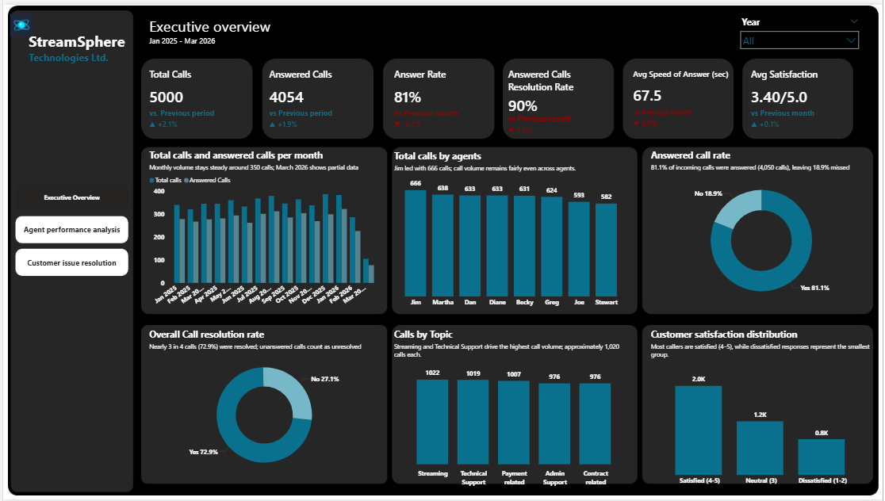
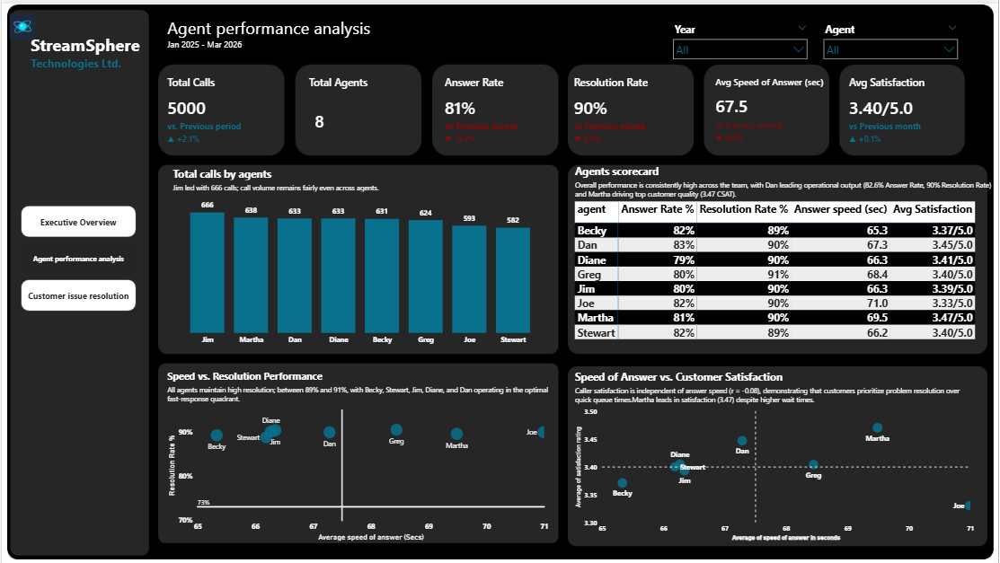
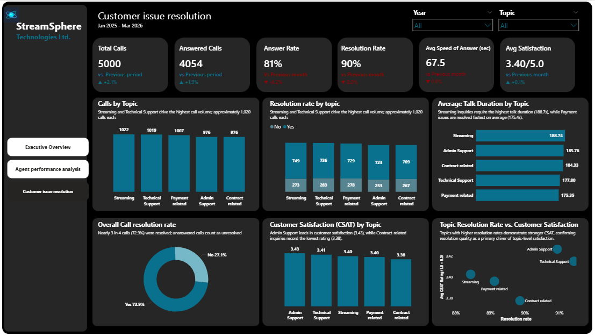

# 📞 StreamSphere Technologies: Call Center Performance Analysis

> **An end-to-end customer support analytics project: Excel data preparation → Power BI interactive dashboard → executive PowerPoint report with data-driven recommendations.**

**Author:** Stella Obase | *STELLANALYZES* | Data Analyst
**Period analyzed:** 1 Jan 2025 to 9 Mar 2026 (15 months)

---

## 📑 Table of Contents

1. [Executive Summary](#-executive-summary)
2. [Business Context](#-business-context)
3. [Objectives](#-objectives)
4. [Dataset](#-dataset)
5. [Tools & Methodology](#-tools--methodology)
6. [KPI Definitions](#-kpi-definitions)
7. [Dashboard Walkthrough](#-dashboard-walkthrough)
8. [Key Findings](#-key-findings)
9. [Recommendations](#-recommendations)
10. [Repository Structure](#-repository-structure)
11. [How to Use This Project](#-how-to-use-this-project)
12. [Limitations & Analyst Notes](#-limitations--analyst-notes)
13. [Skills Demonstrated](#-skills-demonstrated)
14. [Contact](#-contact)

---

## 🎯 Executive Summary

StreamSphere Technologies' Managing Director raised concerns about unanswered calls, slow response times, unresolved issues, inconsistent agent performance, and uneven customer satisfaction. This project analyzes **5,000 support calls** to locate where the operation is losing customers and what to do about it.

| Headline KPI | Result |
|---|---|
| Total calls | **5,000** |
| Answered calls | **4,054** (81.1% answer rate) |
| Unanswered calls | **946** (18.9%) |
| Answered Calls Resolution Rate | **~90%** (89.9%) |
| Overall Call Resolution Rate (all 5,000 calls) | **72.9%** |
| Avg. speed of answer | **67.5 sec** |
| Avg. talk duration | **3.7 min** |
| Avg. customer satisfaction (CSAT) | **3.40 / 5.0** |

**The core insight:** the biggest problem is not how well agents handle calls. It is that **nearly 1 in 5 customers never reaches an agent at all**, and that gap stays flat month after month, which points to a *capacity and queue-management* issue rather than a seasonal one.

---

## 🏢 Business Context

The request came from a formal memo from the Managing Director (9 March 2026) asking the Data Analytics Team for:

- A comprehensive analysis of customer support call data
- An **interactive dashboard** for leadership to monitor operational metrics
- A final report with **data-driven recommendations** on response times, resolution rates, agent performance, and customer satisfaction

Concerns raised in the memo:

| # | Management concern |
|---|---|
| 1 | Increasing number of unanswered customer calls |
| 2 | Slow response times |
| 3 | Unresolved issues in certain service categories |
| 4 | Inconsistent agent performance |
| 5 | Variable customer satisfaction ratings |
| 6 | Certain topics recurring more frequently |

---

## 🧭 Objectives

| # | Objective | What it answers |
|---|---|---|
| 1 | **Call Volume Analysis** | How are received, answered, and unanswered calls trending over time? |
| 2 | **Agent Performance Evaluation** | How does each agent compare on answer rate, resolution, speed, and CSAT? |
| 3 | **Call Resolution Analysis** | What share of calls are resolved, and where is resolution weakest? |
| 4 | **Customer Issue Analysis** | Which topics are most common and which take the most effort? |
| 5 | **Customer Satisfaction Assessment** | Do speed of answer and call duration influence CSAT? |
| 6 | **Operational Efficiency Review** | Where are the bottlenecks, and what should change? |

---

## 🗂️ Dataset

**File:** `Call_center_dataset.xlsx`
**Size:** 5,000 rows × 10 columns, no duplicate call IDs

| Column | Type | Description |
|---|---|---|
| `call id` | Text | Unique call identifier (ID0001 onward) |
| `agent` | Text | Agent who handled the call (8 agents) |
| `date` | Date | Call date (1 Jan 2025 to 9 Mar 2026) |
| `time` | Time | Call time |
| `topic` | Text | Streaming, Technical Support, Payment related, Admin Support, Contract related |
| `answered (Y/N)` | Text | Whether the call was answered |
| `resolved` | Text | Whether the issue was resolved |
| `speed of answer in seconds` | Number | Wait time before answer (blank if unanswered) |
| `avgtalkduration` | Number | Talk time in seconds (0 if unanswered) |
| `satisfaction rating` | Number | CSAT 1 to 5 (answered calls only, 4,054 ratings) |

### 🧹 Data preparation notes

- Unanswered calls correctly carry blank speed-of-answer and satisfaction values, with talk duration set to 0.
- No duplicate call IDs were found.
- Satisfaction is only available for answered calls, so CSAT metrics are calculated on that subset.
- The `resolved` flag exists for all 5,000 records, so resolution is reported **two ways** (see [KPI Definitions](#-kpi-definitions)).
- **March 2026 is partial data** (data ends 9 March), so it should not be compared to full months.

---

## 🛠️ Tools & Methodology

| Stage | Tool | Purpose |
|---|---|---|
| Data inspection & cleaning | **Microsoft Excel** | Validate fields, check duplicates, confirm blank logic |
| Modeling & visualization | **Power BI Desktop** | KPI cards, DAX measures, 3-page interactive dashboard |
| Reporting | **PowerPoint** | 12-slide executive report with findings and roadmap |

**Workflow**

```text
Memo / business brief
        │
        ▼
Data validation & cleaning (Excel)
        │
        ▼
Data model + DAX measures (Power BI)
        │
        ▼
3-page interactive dashboard (Year, Topic, Agent slicers)
        │
        ▼
Insights → Recommendations → Executive deck
```

---

## 📐 KPI Definitions

| KPI | Definition |
|---|---|
| **Total Calls** | Count of all call records |
| **Answered Calls** | Calls where `answered = Y` |
| **Answer Rate** | Answered Calls ÷ Total Calls |
| **Answered Calls Resolution Rate** | Resolved calls ÷ **answered** calls (headline KPI card, ~90%) |
| **Overall Call Resolution Rate** | Resolved calls ÷ **all** calls (72.9%; unanswered calls count as unresolved) |
| **Avg. Speed of Answer (ASA)** | Mean wait time in seconds, answered calls only |
| **Avg. Talk Duration** | Mean talk time, answered calls only |
| **Avg. Satisfaction (CSAT)** | Mean 1 to 5 rating, answered calls only |

---

## 📊 Dashboard Walkthrough

The Power BI report (`Streamsphere_Technologies.pbix`) has three navigable pages with a dark theme and consistent KPI header cards.

### 1️⃣ Executive Overview
*Slicer: Year*

- KPI cards: Total Calls, Answered Calls, Answer Rate, Answered Calls Resolution Rate, Avg Speed of Answer, Avg Satisfaction
- Total vs. answered calls per month (volume trend)
- Total calls by agent
- Answered call rate (donut)
- Overall Call Resolution Rate (donut; unanswered calls count as unresolved)
- Calls by topic
- Customer satisfaction distribution (Satisfied 4 to 5, Neutral 3, Dissatisfied 1 to 2)



### 2️⃣ Agent Performance Analysis
*Slicers: Year, Agent*

- Total calls by agent
- **Agent scorecard** (answer rate, resolution rate, answer speed, avg. satisfaction)
- Speed vs. resolution performance (scatter with quadrants)
- Speed of answer vs. customer satisfaction (scatter with average reference lines)



### 3️⃣ Customer Issue Resolution
*Slicers: Year, Topic*

- Calls by topic
- Resolution rate by topic (resolved vs. unresolved)
- Average talk duration by topic
- CSAT by topic
- Topic resolution rate vs. CSAT (scatter)



---

## 🔍 Key Findings

### 1. 📉 A persistent capacity gap: 18.9% of calls go unanswered

946 of 5,000 calls were never answered. The unanswered rate sits between roughly **16% and 23% in nearly every full month**, with no seasonal pattern that would explain it away.

| Month | Total calls | Unanswered | Unanswered % |
|---|---|---|---|
| Jan 2025 | 340 | 62 | 18.2% |
| Jun 2025 | 333 | 71 | 21.3% |
| Oct 2025 | 364 | 60 | 16.5% |
| **Dec 2025** | **387** | **88** | **22.7%** |
| Jan 2026 | 383 | 61 | 15.9% |

Volume peaked in **Dec 2025 (387)** and **Jan 2026 (383)**, and December also had the worst unanswered count (88).

### 2. ⏱️ Speed of answer: fine on average, painful in the tail

- Average speed of answer: **67.5 seconds** (median 68 s)
- About **30% of answered calls waited more than 90 seconds**
- Only **4.3%** waited more than 120 seconds, but those callers gave the lowest average CSAT (**3.28** vs. 3.40 overall)

### 3. ✅ Resolution is strong once a call is answered

| Topic | Resolution rate (answered) |
|---|---|
| Technical Support | 91.4% |
| Admin Support | 90.9% |
| Contract related | 89.9% |
| Payment related | 89.1% |
| Streaming | **88.4%** (lowest) |

Streaming (1,022 calls) and Technical Support (1,019) are the highest-volume topics, though topic volumes are fairly balanced (976 to 1,022).

### 4. 👥 Agent performance is tightly clustered

| Agent | Calls | Answer % | Resolve %* | Avg Speed | Avg CSAT |
|---|---|---|---|---|---|
| Martha | 638 | 80.6% | 89.7% | 69 s | **3.47** |
| Dan | 633 | 82.6% | 90.1% | 67 s | 3.45 |
| Diane | 633 | 79.2% | 90.2% | 66 s | 3.41 |
| Greg | 624 | 80.5% | 90.6% | 68 s | 3.40 |
| Stewart | 582 | 82.0% | 88.9% | 66 s | 3.40 |
| Jim | 666 | 80.5% | 90.5% | 66 s | 3.39 |
| Becky | 631 | 81.9% | 89.4% | 65 s | 3.37 |
| Joe | 593 | 81.6% | 90.1% | **71 s** | **3.33** |

\*Resolve % calculated on answered calls only.

- **Top satisfaction:** Martha (3.47) and Dan (3.45)
- **Coaching opportunities:** Joe (slowest answer, lowest CSAT) and Stewart (lowest resolution)
- The spread between agents is small, so this is a **system and capacity story more than an individual performance story**.

### 5. 😊 What drives satisfaction?

- CSAT averages **3.40 / 5**; the distribution is roughly 2.0K satisfied (4 to 5), 1.2K neutral (3), and 0.8K dissatisfied (1 to 2).
- At agent level, speed of answer and CSAT show almost no relationship (r ≈ -0.08). Martha has the highest CSAT despite slower answer times.
- Extreme waits (>120 s) are the clearest negative signal in the data.

---

## 💡 Recommendations

| Priority | Action | Target / KPI |
|---|---|---|
| 🔴 **1. Close the capacity gap** | Add staffing for peak hours and introduce callback / IVR self-service so callers are not lost | Unanswered rate **< 10% within 90 days** |
| 🟠 **2. Reduce wait times** | Skills-based routing and real-time queue alerts | **80% of calls answered within 45 s** |
| 🟡 **3. Lift resolution rates** | Specialist playbooks and better knowledge-base tools for Streaming and Payment issues | Streaming and Payment resolution ≥ 91% |
| 🟢 **4. Targeted agent coaching** | Coach Joe on speed/satisfaction and Stewart on resolution; share Martha and Dan's practices | Narrow CSAT spread across agents |
| 🔵 **5. Monitor & iterate** | Review the dashboard weekly; track Answer Rate, ASA, Resolution Rate, and CSAT by agent and topic | Weekly leadership review cadence |

**Planning note:** staff ahead of the **Dec to Jan peak**, when volume and unanswered calls are highest.

---

## 📁 Repository Structure

```text
streamsphere-call-center-analysis/
│
├── 📄 README.md
├── 📂 data/
│   └── Call_center_dataset.xlsx
├── 📂 dashboard/
│   └── Streamsphere_Technologies.pbix
├── 📂 reports/
│   ├── StreamSphere_Call_Center_Analysis.pptx
│   └── MP_Powerbi_Project_2.pdf        # Original MD memo / project brief
└── 📂 images/
    ├── 01_executive_overview.png
    ├── 02_agent_performance.png
    └── 03_customer_issue_resolution.png
```

---

## 🚀 How to Use This Project

```bash
# 1. Clone the repository
git clone https://github.com/stellabolade/streamsphere-call-center-analysis.git

# 2. Open the dashboard
#    Requires Power BI Desktop (free, Windows)
#    Open: dashboard/Streamsphere_Technologies.pbix

# 3. If prompted, refresh the data source
#    Home → Transform data → Data source settings → point to data/Call_center_dataset.xlsx
```

**Navigating the report:** use the left-hand page buttons to switch pages, and the **Year / Topic / Agent** slicers to filter every visual on the page.

---

## ⚠️ Limitations & Analyst Notes

Being transparent about the data builds trust in the insights:

- **March 2026 is partial** (data ends 9 March); it is excluded from any month-over-month conclusion.
- **Two resolution figures exist by design:** the **Answered Calls Resolution Rate** (~90%) and the **Overall Call Resolution Rate** (72.9%, where unanswered calls count as unresolved). 
- **CSAT is only captured on answered calls**, so callers who gave up are invisible in satisfaction scores.
- **Satisfaction is flat across most dimensions** (agent, topic, wait bucket), so differences of a few hundredths of a point should be read as directional, not conclusive.
- Root causes of unanswered calls (staffing levels, shift coverage, queue abandonment) are **not in the dataset**; the capacity conclusion is an inference from the pattern, so validate it with workforce data.

---

## 🧠 Skills Demonstrated

| Area | Skills |
|---|---|
| **Data analysis** | Data validation, KPI design, trend analysis, segmentation by agent/topic/time |
| **Power BI** | Data modeling, DAX measures, slicers, page navigation, dark-theme dashboard design |
| **Excel** | Data cleaning and quality checks |
| **Storytelling** | Turning a management memo into objectives, findings, and a prioritized roadmap |
| **Communication** | Executive deck written for both technical reviewers and business leaders |
| **Critical thinking** | Separating capacity problems from agent problems; flagging data limitations |

---

## 📬 Contact

**Stella Obase** | *STELLANALYZES*
Data Analyst | Healthcare Data Analyst Track

- 💼 LinkedIn: [linkedin.com/in/stellaobase](https://www.linkedin.com/in/stellaobase)
- 🐙 GitHub: [@stellabolade](https://github.com/stellabolade)

⭐ If you found this project useful, consider starring the repo!

---

*This project was completed as a portfolio piece based on a simulated business brief for StreamSphere Technologies Ltd.*
